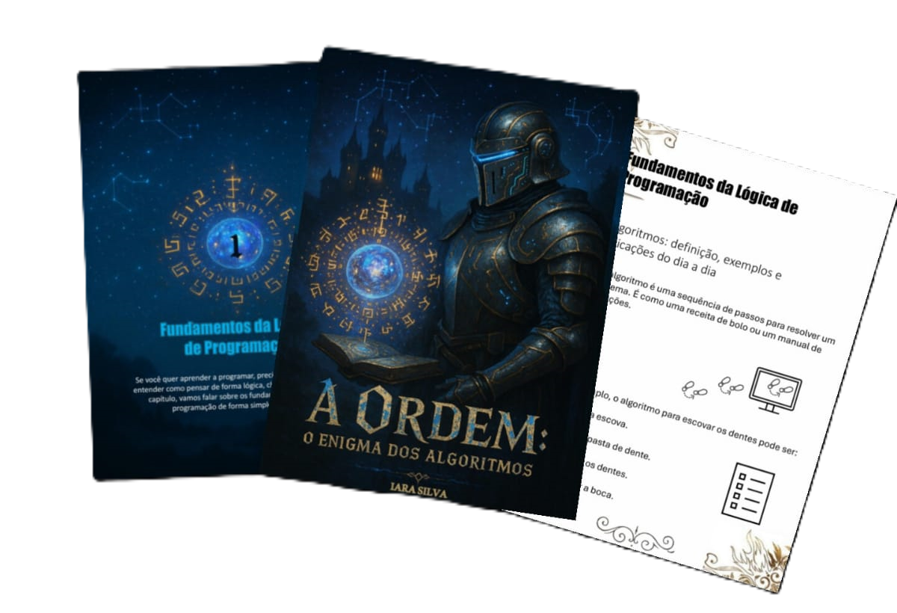

<h1>Projeto EBOOK Gerado por I.A.s</h1>

Projeto desenvolvido com o objetivo de gerar um ebook com as facilidades das ferramentas de IA

<h2>💻Tecnologias utilizadas no projeto</h2>
<ul>
  <li><a href="https://chatgpt.com/" target="_blank" rel="external">ChatGTP</a></li>
  <li><a href="https://copilot.microsoft.com/chats/RCMek8FamzdPYvSfWLts1" target="_blank" rel="external">Microsoft Copilot</a></li>
  <li><a href="https://www.microsoft.com/en/microsoft-365/powerpoint" target="_blank" rel="external">PowerPoint</a></li>
</ul>

<h2> 🧠Prompts</h2>

ChatGTP:

|   Ação   | prompt |
| :------: | ------ |
|  título  | Crie um título de um ebook sobre lógica de programação, o ebook é do nicho de programação.O título deve ser épico e curto, e tenha uma temática mitologica, caveleiros.Me liste 5 exemplos. |          |
| conteúdo | Faça um texto para o ebook, com foco em lógica de programação, listando os principais temas com exemplos de código. {REGRAS} Explique sempre de uma maneira simples, Deixe o texto enxuto, sempre deixe um título sugestivo por tópico |

Microsoft Copilot:

|  Ação  |  prompt                                                                                                                                                                                                 |
| :----: | ------------------------------------------------------------------------------------------------------------------------------------------------------------------------------------------------------- |
| título | A mysterious knight in ancient armor, with subtle futuristic details like glowing circuits and a visor embedded in the helmet. He stands before a floating artifact — a crystal orb or ancient book — surrounded by glowing algorithmic symbols resembling ancient runes. The background is a mystical medieval landscape: a dark castle with towers emitting light, under a starry sky where constellations form digital patterns. The overall tone is dark and magical, with blue, gold, and violet hues. The title "A Ordem: O Enigma dos Algoritmos" appears in a stylized font blending medieval script with digital glitch effects.    |

<h2>✨Features</h2>
<ul>
  <li>Conteúdo gerado via ChatGTP</li>
  <li>Imagens geradas via Microsoft Copilot</li>  
</ul>

<h2>📚Materiais</h2>

<ul>
  <li>Imagens utilizadas em (assets)</li>
  <li>Ebook criado em (output)</li>
</ul>

<h2>👨‍💻 Expert</h2>

    

Iara Silva

   <a href="https://www.linkedin.com/in/iara-cristina-6b3736352?utm_source=share&utm_campaign=share_via&utm_content=profile&utm_medium=android_app" target="_black" rel="external">
  
  <a href="https://www.instagram.com/itsiarah?igsh=cWgyOGRrdXBnaGxo" target="_black" rel="external">
  

